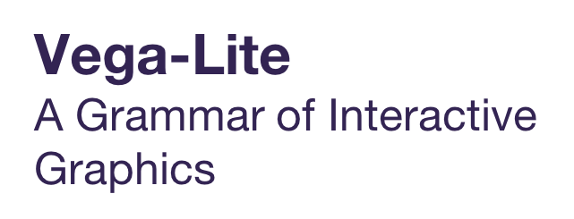

```{r setup, include=FALSE}
knitr::opts_chunk$set(
	echo = FALSE,
	message = FALSE,
	warning = FALSE
)
```


<h2>**OxShef: Tools** provides advice on choosing data visualisations tools that [support a reproducible dataviz workflow](reproducible-dataviz-workflow.html).</h2>

<center>

</img>

</center>

<hr>

<h2> **OxShef: Tools** maintains an overview of [popular data visualisation tools](list-of-tools.html) and dedicated websites for select technologies which fully support accessing data from DOI-issuing repositories.</h2>

<center>

<p>
&nbsp;&nbsp;
&nbsp;&nbsp;
&nbsp;&nbsp;


</p>
</center>

<h2>**OxShef: Tools** provides an overview of several [visualisation tools](https://tools.oxshef.io) widely used in academia. The flowchart below is designed to guide you whether our resources can help you visualise your dataset:</h2> 

```{r tool-selection-css, results="asis", echo=FALSE}
cat("
<style>
#mermaidChart0 { 
    min-height: 900px;
    min-width: 800px;
}
</style>
")
```

```{r tool-selection-flowchart, echo = FALSE, fig.height=6}
# library("DiagrammeR")
# 
# oxshef_flowchart <- DiagrammeR("graph TB;
#            A{Is your data public?} -- yes -->doiQuestion;
#            A -- no -->B[<center><b>Oxshef: dataviz</b> exclusively supports researchers in <br> the visualisation and promotion of <br> public datasets.</center>];
#            doiQuestion{<center>Is your dataset published<br> to a DOI-issuing data repository?</center>};
#            doiNotIssued[<center>Please ensure to deposit your data<br> in a DOI-issuing repository</center>]
#            doiQuestion -- yes --> externalDataQuestion;
#            doiQuestion -- no --> doiNotIssued;
#            externalDataQuestion{<center>Does your visualisation tool <br> allow data to be pulled from <br> your data repository?</center>};
#            externalDataSupported[<center>Excellent!<br> Our resources are designed for you!</center>];
#            externalDataUnsupported[<center>We recommend <b>not</b> using these tools</center>];
#            externalDataUnknown[<center>Refer to our <br>http://oxshef-charts.netlify.com/tools.html page</center>];
#            externalDataQuestion -- yes -->externalDataSupported;
#            externalDataQuestion -- no -->externalDataUnsupported;
#            externalDataQuestion -- I don't know -->externalDataUnknown",
#            width = "100%",
#            height = "900px")
# library("htmltools")
# 
# div(oxshef_flowchart)
library("tidyverse")
library("visNetwork")
library("emo")

nodes <- tribble(
  ~id, ~label, ~title, ~shape, ~size, ~color,
  1, "Is your data public?", NA, "diamond", 25, "#97C2FC",
  2, ji("white_check_mark"), NA, "dot", 5, "green",
  3, ji("x"), NA, "dot", 5, "red",
  4, "Reproducible dataviz require Open Data. \nLearn more at oxshef.io", "<a href='https://oxshef.io' target='_blank'>oxshef.io</a>", "square", 25, "#97C2FC",
  5, "Does your dataset \nhave a DOI?", NA, "diamond", 25, "#97C2FC",
  6, ji("x"), NA, "dot", 5, "red",
  7, ji("white_check_mark"), NA, "dot", 5, "green",
  8, "Visit repositories.oxshef.io \nto learn about DOI", "<a href='https://repositories.oxshef.io' target='_blank'>repositories.oxshef.io</a>", "square", 25, "red",
  9, "Does your dataviz\n pull data from a data repository?", NA, "diamond", 25, "#97C2FC",
  10, ji("white_check_mark"), NA, "dot", 5, "green",
  11, ji("x"), NA, "dot", 5, "red",
  12, "You have a reproducible \ndataviz workflow!", NA, "dot", 25, "green",
  13, "Visit tools.oxshef.io \nto learn more", "<a href='https://tools.oxshef.io' target='_blank'>tools.oxshef.io</a>", "dot", 25, "red"
)

edges <- tribble(
  ~from, ~to,
  1, 2,
  1, 3,
  3, 4,
  2, 5,
  5, 7,
  5, 6,
  6, 8,
  7, 9,
  9, 10,
  9, 11,
  10, 12,
  11, 13
)

visNetwork(nodes, edges, width = "100%", height = "500px") %>% 
  visEdges(color = "#97C2FC") %>%
  visNodes(font = list(size = 16)) %>%
  visInteraction(dragNodes = FALSE, dragView = FALSE, selectable = FALSE) %>%
  visHierarchicalLayout(direction = "LR", 
                        levelSeparation = 180, 
                        sortMethod = "directed",
                        blockShifting = FALSE,
                        edgeMinimization = FALSE)

```


